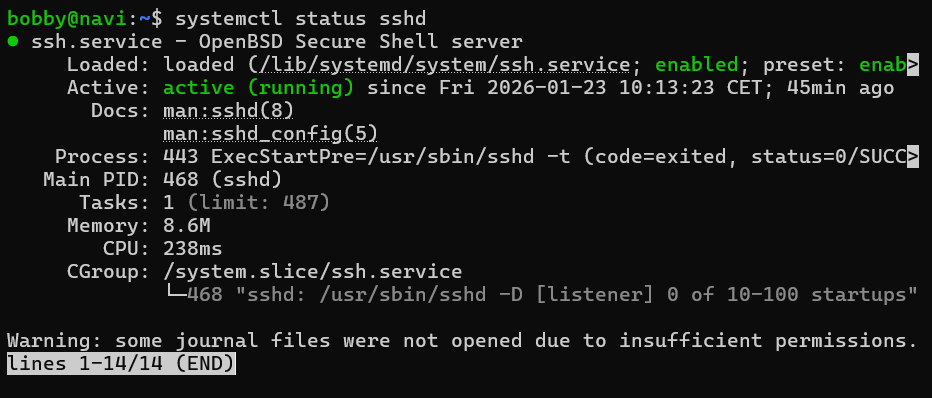
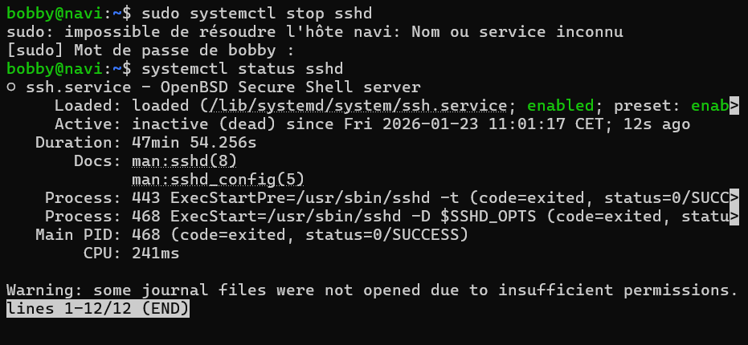
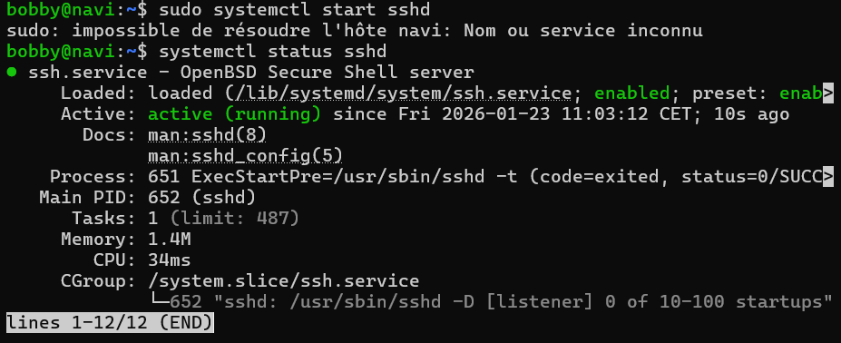
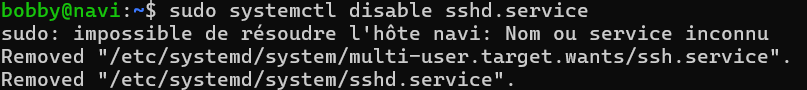

# **Objectifs de la Story :**

>En tant qu'équipe, 
nous voulons montrer comment démarrer, arrêter, redémarrer et connaître l'état d'un service (par exemple sshd) avec systemctl, 
afin de comprendre la gestion des services sous
Linux.

# **Critères d'acceptation :**

>Vérifier l'état d'un service et interpréter les couleurs/statuts.
>
>Arrêter et démarrer un service manuellement.
>
>Expliquer la différence entre restart et reload.
>
>Expliquer la distinction entre un service actif et un service activé.
>
>Rendre un service permanent.
>
>Empêcher le démarrage automatique d'un service.
>
>Vérifier si un service démarrera de manière automatique ou non.

# **Resultat:**

>systemctl status <service> : donne les informations d'un service
>
>sudo systemctl stop <service> : arrête un service
>
>sudo systemctl start <service> : démarre un service
>
>systemctl reload <service> : relis la configuration logicielle et la recharge, pas d'interruption de service
>systemctl restart <service> : arrête le service et le redémarre.
>service actif : en cours d'exécution.
>service activé : service chargé mais pas nécessairement en cours d'exécution.
>sudo systemctl enable <service> : permet de rendre un service permanent.
>sudo systemctl disable application.service : empêche le démarrage automatique d'un service
>
>systemctl is-enabled application.service : vérifie si un service démarre de manière automatique ou non