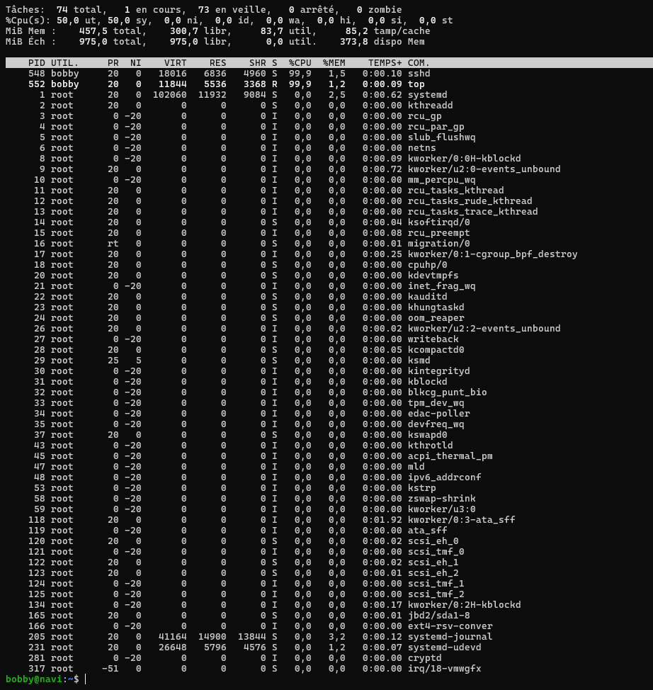
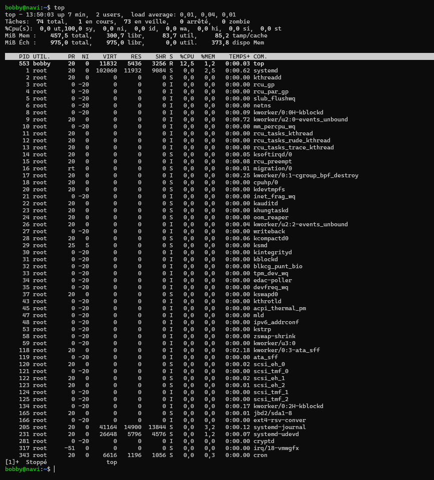
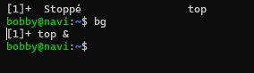
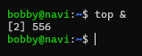
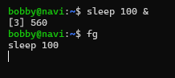
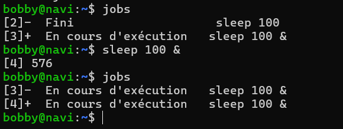

# **Objectifs de la Story :**

>En tant qu’utilisateur, 
je veux comprendre les différences entre les processus en avant-plan et en arrière-plan, afin de mieux les gérer avec des commandes comme bg et fg.

# **Critères d'acceptation :**

>Interrompre et tuer définitivement un processus en avant-plan.
>
>Mettre un processus en pause (suspendre) et reprendre la main sur le terminal.
>
>Basculer un processus suspendu vers l'arrière-plan pour qu'il continue son exécution sans bloquer le terminal.
>
>Ramener un processus d'arrière-plan vers l'avant-plan pour interagir à nouveau avec lui.
>
>Lancer une commande directement en arrière-plan.
>
>Lister tous les travaux en cours dans la session actuelle.
>
>Faire la différence entre un PID (identifiant système global) et un Job ID.
>
>Expliquer ce qui arrive à un processus en arrière-plan si on ferme le terminal … et savoir utiliser nohup.

# **Resultat:**

> Pour interrompre et tuer le processus en cours d'exécution dans le terminal , on utilise CTRL + C , qui envoie un signal SIGINT au processus.
>
>- 
>
>Pour mettre en pause un processus , on va faire CTRL + Z , qui envoie un signal SIGTSTP au processus qui va le mettre en arriere plan.
>
>- 
>
>Apres avoir envoyer le signal SIGTSTP , on peut utiliser la commande 'bg' pour relancer le processus mais en arrière-plan.
>
>- 
>
>Pour lancer directement en arrère-plan , on va rajouter '&' à la fin d'une commande.
>
>- 
>
>Pour ramener un processus en avant-plan , on utilise la commande 'fg' .
>
>- 
>
>On va utiliser la commande 'jobs' pour lister les processus lier à la session.
>
>- 
>
>Le PID est l'identifiant unique d'un processus tandis que Job ID possède un identifiant propre a la session actuelle.
>
>En fermant un processus en arrière-plan , ca envoie un signal SIGHUP pour informer la fermeture du processus. En utilisant 'NOHUP' , on peut bloquer l'envoie du signal SIGHUP et empecher la fermeture du processus.